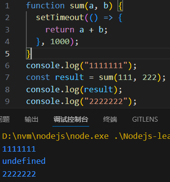
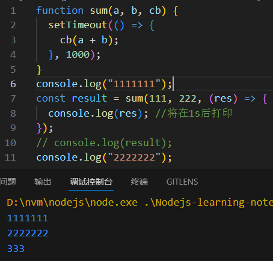
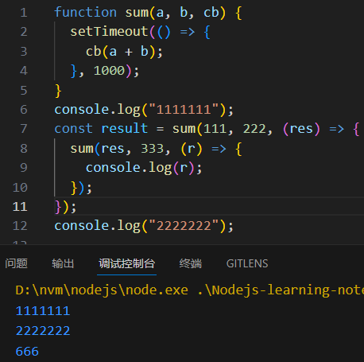
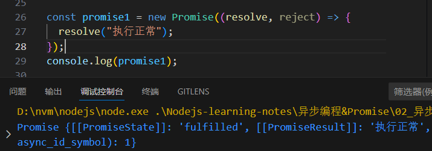
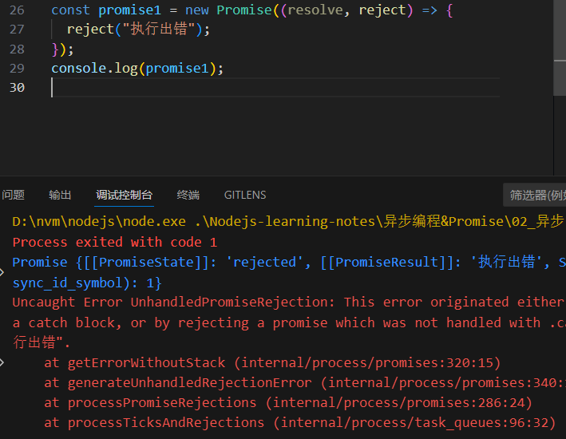
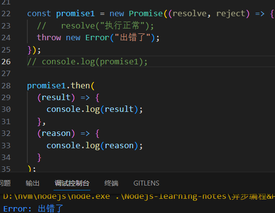
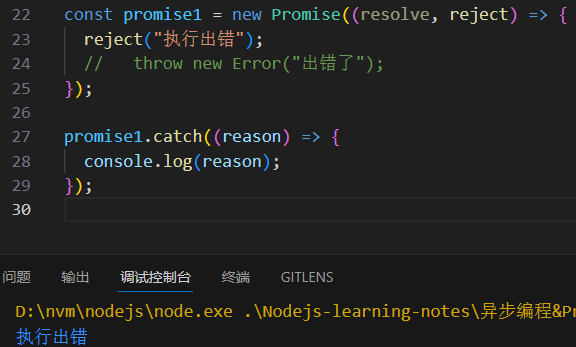
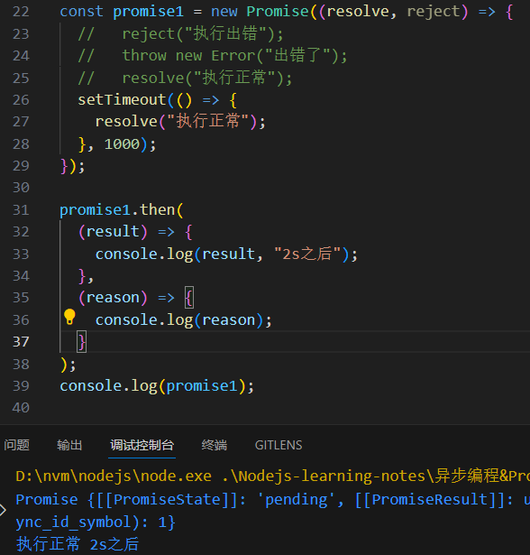

# 异步编程和 Promise

## 同步问题

有些函数需要执行很久，但是代码执行顺序是顺序执行的，这样会导致阻塞。

## 解决同步问题

### java 和 python

java 和 python 使用**多线程**解决这个问题。

### JavaScript

- 使用**setTimeout**：单独使用 setTimeout 虽然可以使得打印结果可以快速出现，无需等待，但是却得不到我们想要的输出结果。
  
- 使用**回调函数**：向 sum 传递一个回调函数，在定时器结束后自动返回我们想要的输出结果。
  
  但是，如果我们想要将得到的结果再加一个数呢？
  于是我们使用刚刚的方法再调用一次：
  
  问题来了，如果我们需要进行很多次这样的操作，不就是要写很多遍这样的代码?！这种方式显然是不可取的。

## Promise 横空出世

### Promise 是什么

上面使用异步调用来进行一些比较负责的调用时，会出现回调地狱的情况。因为异步必须通过回调函数来返回结果。
Promise 可以用来存储异步调用的结果。

### 创建 Promise

Promise 对象的创建需要传一个**回调函数**作为参数。
关于这个回调函数：

- 这个回调函数有两个参数，这两个参数都是函数类型，一个是 resolve，一个是 reject，这两个函数可以向 Promise 中存储数据
  - resolve：在执行正常的时候存储数据
  - reject：在执行错误时存储数据
- 为什么这两个参数是函数呢？因为可以通过函数来向 Promise 中添加异步调用的数据。正如上方 setTimeout 不能直接 return 计算结果，而需要使用回调函数的道理是一样的。

```javascript
const promise1 = new Promise((resolve, reject) => {
  resolve("执行正常");
});
console.log(promise1);
```



```javascript
const promise1 = new Promise((resolve, reject) => {
  reject("执行出错");
});
console.log(promise1);
```



### 从 Promise 中读取数据

#### 通过 Promise.then 读取数据

then 方法需要两个回调函数作为参数。

- 第一个回调函数可以取 resolve 存的数据
- 第二个回调函数可以取 reject 存的数据或者我们自己抛出的异常数据

```javascript
promise1.then(
  (result) => {
    console.log(result);
  },
  (reason) => {
    console.log(reason);
  }
);
```



#### 通过 Promise.catch 读取数据

catch 方法需要一个回调函数作为参数。这个回调函数用来获取 reject 存储的数据或者出错的数据，相当于`then(null,()=>{})`

```javascript
promise1.catch((reason) => {
  console.log(reason);
});
```



#### 通过 Promise.finally 读取数据

finally 是每次都会执行的代码，无论 promise 是用 resolve 存储数据，还是 reject 存储数据，甚至出错的时候也会执行。finally 方法需要一个回调函数作为参数。

```javascript
promise1.finally(() => {
  console.log("每次都会执行的代码");
});
```

### Promise 的两个属性

#### PromiseResult

用来存储数据，上面无论用 resolve 存储数据，还是用 reject 存储数据，最终都会存在这个属性里。
那么，我们为什么要用`.then`去获取数据，而不是直接通过这个属性来获取呢?其实我们获取数据并不难，我们使用 then 主要是在正确的时机获取数据。那我们如何知道获取数据的时机呢？这就要说到 Promise 的第二个属性 PromiseState 了。

#### PromiseState

PromiseState 有三个值：

- fulfilled：执行正常
- rejected：执行被拒绝，出错了
- pending：进行中（数据还没存进去，无论正常、错误）
  
  **then、catch、finally 都是根据 PromiseState 的值来处理数据的。**
